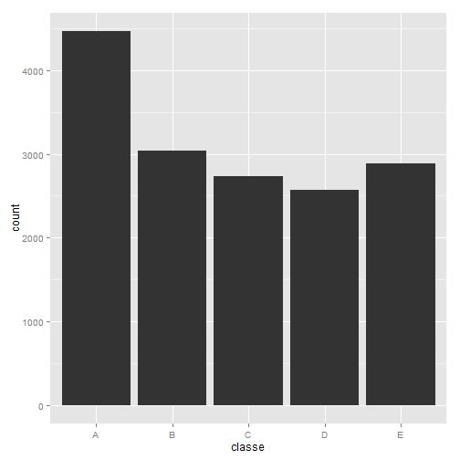
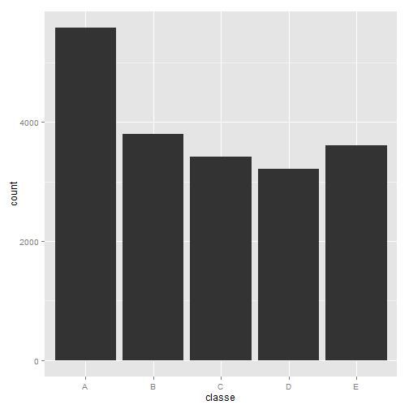

Practical Machine Learning Project: Predicting Excercise Manners
==========================================================================================================

### 0. Synopsis

Using devices such as Jawbone Up, Nike FuelBand, and Fitbit it is now possible to collect a large amount of data about personal activity relatively inexpensively. These type of devices are part of the quantified self movement - a group of enthusiasts who take measurements about themselves regularly to improve their health, to find patterns in their behavior, or because they are tech geeks. One thing that people regularly do is quantify how much of a particular activity they do, but they rarely quantify how well they do it. In this project, your goal will be to use data from accelerometers on the belt, forearm, arm, and dumbell of 6 participants. They were asked to perform barbell lifts correctly and incorrectly in 5 different ways. The goal of this project is to predict the manner in which subjects exercise.

The training data for this project are available here:

https://d396qusza40orc.cloudfront.net/predmachlearn/pml-training.csv

The test data are available here: 

https://d396qusza40orc.cloudfront.net/predmachlearn/pml-testing.csv

The outcome variable is classe, a factor variable with 5 levels. For this data set, "participants were asked to perform one set of 10 repetitions of the Unilateral Dumbbell Biceps Curl in 5 different fashions:

- exactly according to the specification (Class A)
- throwing the elbows to the front (Class B)
- lifting the dumbbell only halfway (Class C)
- lowering the dumbbell only halfway (Class D)
- throwing the hips to the front (Class E)"

### 1. Setting the basic parameters

Loading frequently used functions consolidated in the misc.R script file (such as _downloadFile()_ and _getNAStrings()_)

```r
source("../common/misc.R")
```

Logging session information for debugging

```r
origLocale <- Sys.getlocale("LC_TIME")
session <- sessInfo(clear=TRUE, loc=c("LC_TIME", "English"), log=TRUE)
```

Loading required libraries

```r
library(ggplot2)
library(caret)
library(randomForest)
library(rpart)
library(e1071)
library(knitr)
```

Changing basic R options

```r
options(scipen=999)
```

Setting up input and data directory

```r
inputDir <- "../Pract_Mach_Learn"
dataDir <- file.path(inputDir,"data")
```

Downloading source files

```r
downloadFile(dataDir, "training_set.csv", 
             "http://d396qusza40orc.cloudfront.net/predmachlearn/pml-training.csv")

downloadFile(dataDir, "testing_set.csv", 
             "http://d396qusza40orc.cloudfront.net/predmachlearn/pml-testing.csv")
```

Reading in source files

```r
trainFile <- file.path(dataDir, "training_set.csv")
testFile <- file.path(dataDir, "testing_set.csv")

data.train <- read.csv(trainFile, header = TRUE, sep = ",", na.strings = getNaStrings(), stringsAsFactors = FALSE)
data.test <- read.csv(testFile, header = TRUE, sep = ",", na.strings = getNaStrings(), stringsAsFactors = FALSE)
```

Setting seed for reproducibility

```r
set.seed(230215)
```

### 2. Preprocessing the data

A quick look into the data revealed, that even though missing values have been detected and replaced with "NA", there are several columns consisting only of missing values. Thus, before being able to build an adequate prediction model, we have to preprocess the data. First, we removed variables with low variance values. Second, we checked for possible duplicate entries and removed the first 6 columns, since timestamp related data as well as ID columns are not helpful for our analysis. Third, we removed entire missing value columns from the data frame. 


```r
data.train.nearzero <- nearZeroVar(data.train, saveMetrics = TRUE)
data.train <- data.train[, !data.train.nearzero$nzv]
data.train <- data.train[!duplicated(data.train), -c(1:6)]
data.train <- data.train[, colSums(is.na(data.train)) == 0]
```

We repeated these steps for the testing set and also removed the "problem_id" column:

```r
data.test.nearzero <- nearZeroVar(data.test, saveMetrics = TRUE)
data.test <- data.test[, !data.test.nearzero$nzv]
data.test <- data.test[!duplicated(data.test), -c(1:6)]
data.test <- data.test[, colSums(is.na(data.test)) == 0]
data.test <- data.test[, !(names(data.test) %in% c("problem_id"))]
```

Then, we conducted a correlation analysis in order to find variables with a correlation greater or equal to 0.9.

```r
corr.train <- cor(na.omit(data.train[sapply(data.train, is.numeric)]))
corr.remove <- findCorrelation(corr.train, cutoff = .90, verbose = FALSE)

data.train <- data.train[, -corr.remove]
data.test <- data.test[, colnames(data.test) %in% colnames(data.train)]
```

After the preprocessing steps, the training and testing data set are ready for the analysis. We have reduced both data sets to 46 and 45 variables (the testing set does not have a "classe" column).

### Finding the adequate prediction model

There is a wide range of methods to predict the classe variables. Since we would like to solve a classification problem, we have decided to compare the accuracy of random forest, recursive partitioning, naive bayes and suport vector machines. All these approaches provide a good tradeoff between complexity and performance. The chosen prediction method will then be executed for the classification of our outcome variable from the testing set.

Hence, we start our comparison with cross validation and split our training set into a training and testing subset with a ratio of 80/20.

```r
split <- createDataPartition(y=data.train$classe, p=0.8, list=FALSE) 
data.train.train <- data.train[split, ] 
data.train.test <- data.train[-split, ]
```

As we can see, the distribution of the training subset class variable is nearly the same as in the training set

```r
qplot(classe, data=data.train.train, geom="histogram")
```

 

```r
qplot(classe, data=data.train, geom="histogram")
```

 

Random forest prediction model

```r
md_rf <- randomForest(as.factor(classe) ~ ., data=data.train.train, method="class")
pred_rf <- predict(md_rf, data.train.test, type = "class")
con_rf <- confusionMatrix(pred_rf, data.train.test$classe)
con_rf
```

```
## Confusion Matrix and Statistics
## 
##           Reference
## Prediction    A    B    C    D    E
##          A 1116    0    0    0    0
##          B    0  759    3    0    0
##          C    0    0  681    5    1
##          D    0    0    0  638    3
##          E    0    0    0    0  717
## 
## Overall Statistics
##                                                
##                Accuracy : 0.9969               
##                  95% CI : (0.9947, 0.9984)     
##     No Information Rate : 0.2845               
##     P-Value [Acc > NIR] : < 0.00000000000000022
##                                                
##                   Kappa : 0.9961               
##  Mcnemar's Test P-Value : NA                   
## 
## Statistics by Class:
## 
##                      Class: A Class: B Class: C Class: D Class: E
## Sensitivity            1.0000   1.0000   0.9956   0.9922   0.9945
## Specificity            1.0000   0.9991   0.9981   0.9991   1.0000
## Pos Pred Value         1.0000   0.9961   0.9913   0.9953   1.0000
## Neg Pred Value         1.0000   1.0000   0.9991   0.9985   0.9988
## Prevalence             0.2845   0.1935   0.1744   0.1639   0.1838
## Detection Rate         0.2845   0.1935   0.1736   0.1626   0.1828
## Detection Prevalence   0.2845   0.1942   0.1751   0.1634   0.1828
## Balanced Accuracy      1.0000   0.9995   0.9969   0.9957   0.9972
```

Recursive Partitioning prediction model

```r
md_rp <- rpart(as.factor(classe) ~ ., data=data.train.train, method="class")
pred_rp <- predict(md_rp, data.train.test, type = "class")
con_rp <- confusionMatrix(pred_rp, data.train.test$classe)
con_rp
```

```
## Confusion Matrix and Statistics
## 
##           Reference
## Prediction    A    B    C    D    E
##          A 1017  160   18   26   95
##          B    6  326   17   34    8
##          C   52  139  590  101   74
##          D   28   43   40  419   62
##          E   13   91   19   63  482
## 
## Overall Statistics
##                                                
##                Accuracy : 0.7224               
##                  95% CI : (0.7081, 0.7364)     
##     No Information Rate : 0.2845               
##     P-Value [Acc > NIR] : < 0.00000000000000022
##                                                
##                   Kappa : 0.6472               
##  Mcnemar's Test P-Value : < 0.00000000000000022
## 
## Statistics by Class:
## 
##                      Class: A Class: B Class: C Class: D Class: E
## Sensitivity            0.9113  0.42951   0.8626   0.6516   0.6685
## Specificity            0.8935  0.97946   0.8870   0.9473   0.9419
## Pos Pred Value         0.7728  0.83376   0.6172   0.7078   0.7216
## Neg Pred Value         0.9620  0.87741   0.9683   0.9328   0.9266
## Prevalence             0.2845  0.19347   0.1744   0.1639   0.1838
## Detection Rate         0.2592  0.08310   0.1504   0.1068   0.1229
## Detection Prevalence   0.3355  0.09967   0.2437   0.1509   0.1703
## Balanced Accuracy      0.9024  0.70448   0.8748   0.7994   0.8052
```

Naive bayes prediction model

```r
md_nb <- naiveBayes(as.factor(classe) ~ ., data=data.train.train)
pred_nb <- predict(md_nb, data.train.test, type = "class")
con_nb <- confusionMatrix(pred_nb, data.train.test$classe)
con_nb
```

```
## Confusion Matrix and Statistics
## 
##           Reference
## Prediction   A   B   C   D   E
##          A 501  62  29   5  18
##          B 114 423  78  38 122
##          C 324 146 463 199  86
##          D 132  72  54 316 108
##          E  45  56  60  85 387
## 
## Overall Statistics
##                                                
##                Accuracy : 0.5328               
##                  95% CI : (0.517, 0.5485)      
##     No Information Rate : 0.2845               
##     P-Value [Acc > NIR] : < 0.00000000000000022
##                                                
##                   Kappa : 0.4195               
##  Mcnemar's Test P-Value : < 0.00000000000000022
## 
## Statistics by Class:
## 
##                      Class: A Class: B Class: C Class: D Class: E
## Sensitivity            0.4489   0.5573   0.6769  0.49145  0.53675
## Specificity            0.9594   0.8887   0.7669  0.88841  0.92317
## Pos Pred Value         0.8146   0.5458   0.3801  0.46334  0.61137
## Neg Pred Value         0.8141   0.8933   0.9183  0.89911  0.89848
## Prevalence             0.2845   0.1935   0.1744  0.16391  0.18379
## Detection Rate         0.1277   0.1078   0.1180  0.08055  0.09865
## Detection Prevalence   0.1568   0.1976   0.3105  0.17385  0.16136
## Balanced Accuracy      0.7042   0.7230   0.7219  0.68993  0.72996
```

Support vector machine prediction model

```r
md_sv <- svm(as.factor(classe) ~ ., data=data.train.train, gamma = 0.1)
pred_sv <- predict(md_sv, data.train.test, type = "class")
con_sv <- confusionMatrix(pred_sv, data.train.test$classe)
con_sv
```

```
## Confusion Matrix and Statistics
## 
##           Reference
## Prediction    A    B    C    D    E
##          A 1114   11    0    0    0
##          B    2  742    9    0    0
##          C    0    5  671   38    1
##          D    0    0    3  603    4
##          E    0    1    1    2  716
## 
## Overall Statistics
##                                                
##                Accuracy : 0.9804               
##                  95% CI : (0.9755, 0.9845)     
##     No Information Rate : 0.2845               
##     P-Value [Acc > NIR] : < 0.00000000000000022
##                                                
##                   Kappa : 0.9752               
##  Mcnemar's Test P-Value : NA                   
## 
## Statistics by Class:
## 
##                      Class: A Class: B Class: C Class: D Class: E
## Sensitivity            0.9982   0.9776   0.9810   0.9378   0.9931
## Specificity            0.9961   0.9965   0.9864   0.9979   0.9988
## Pos Pred Value         0.9902   0.9854   0.9385   0.9885   0.9944
## Neg Pred Value         0.9993   0.9946   0.9959   0.9879   0.9984
## Prevalence             0.2845   0.1935   0.1744   0.1639   0.1838
## Detection Rate         0.2840   0.1891   0.1710   0.1537   0.1825
## Detection Prevalence   0.2868   0.1919   0.1823   0.1555   0.1835
## Balanced Accuracy      0.9971   0.9871   0.9837   0.9678   0.9959
```

In order to summarize the relevant information, we consolidated the prediction_results


```r
pred_results <- data.frame(random_forest=pred_rf,
                           recursive_partitioning=pred_rp,
                           naive_bayes=pred_nb,
                           support_vector_machine=pred_sv                           
                           )

acc_results <- data.frame(model=c("random_forest", "recursive_partitioning", "naive_bayes", "support_vector_machines"),
                          accuracy=c(con_rf$overall[1], con_rp$overall[1], con_nb$overall[1], con_sv$overall[1]))

acc_results <- acc_results[order(-acc_results$accuracy),]

kable(acc_results)
```


|   |model                   |  accuracy|
|:--|:-----------------------|---------:|
|1  |random_forest           | 0.9969411|
|4  |support_vector_machines | 0.9803722|
|2  |recursive_partitioning  | 0.7224063|
|3  |naive_bayes             | 0.5327555|

The results suggest, that random forest as well as support vector machine prediction models provide the highest accuracy. Therefore, we used these two methods to predict the "classe" variable in the testing set.


```r
final_rf <- predict(md_rf, data.test, type="class")
final_sv <- predict(md_sv, data.test, type="class")
```

When comparing the results, we see that there is only one difference in predicting the excercise classes for the subjects. However, since random forest has a slightly better accuracy, we decided to use these results for the final submission.

```r
final_results <- data.frame(problem_id=c(1:20),
                            random_forest=final_rf,
                            support_vector_machine=final_sv,
                            check=ifelse(final_rf == final_sv,TRUE,FALSE)
                            )

final_results
```

```
##    problem_id random_forest support_vector_machine check
## 1           1             B                      B  TRUE
## 2           2             A                      A  TRUE
## 3           3             B                      A FALSE
## 4           4             A                      A  TRUE
## 5           5             A                      A  TRUE
## 6           6             E                      E  TRUE
## 7           7             D                      D  TRUE
## 8           8             B                      B  TRUE
## 9           9             A                      A  TRUE
## 10         10             A                      A  TRUE
## 11         11             B                      B  TRUE
## 12         12             C                      C  TRUE
## 13         13             B                      B  TRUE
## 14         14             A                      A  TRUE
## 15         15             E                      E  TRUE
## 16         16             E                      E  TRUE
## 17         17             A                      A  TRUE
## 18         18             B                      B  TRUE
## 19         19             B                      B  TRUE
## 20         20             B                      B  TRUE
```

With a custom _writeOutputfiles_ function, we exported the results as .txt files for upload into the coursera portal. 

```r
writeOutputfiles = function(x){
    n = length(x)
    for(i in 1:n){
        filename = file.path(dataDir, paste0("case_",i,".txt"))   
        write.table(x[i],file=filename,quote=FALSE,row.names=FALSE,col.names=FALSE)
    }
}

writeOutputfiles(final_results$random_forest)
```

Finally, we have to set back the originale locale

```r
session <- sessInfo(clear=TRUE, loc=c("LC_TIME",origLocale), log=TRUE)
```

### References
Ugulino, W.; Cardador, D.; Vega, K.; Velloso, E.; Milidiu, R.; Fuks, H. [Wearable Computing: Accelerometers' Data Classification of Body Postures and Movements.](http://groupware.les.inf.puc-rio.br/har#ixzz3SL0H9aaT) Proceedings of 21st Brazilian Symposium on Artificial Intelligence. Advances in Artificial Intelligence - SBIA 2012. In: Lecture Notes in Computer Science. , pp. 52-61. Curitiba, PR: Springer Berlin / Heidelberg, 2012. ISBN 978-3-642-34458-9. DOI: 10.1007/978-3-642-34459-6_6.
